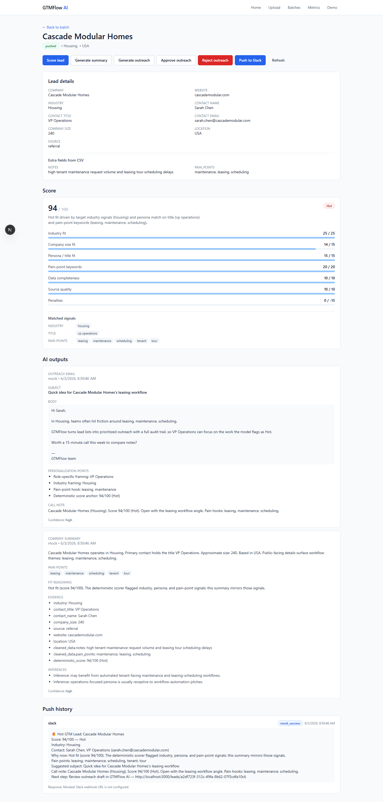

# GTMFlow AI

**GTM automation for a single sales workspace: import a lead list, score it, draft grounded outreach with an AI model, review every draft, and route approved Hot leads to Slack, with an audit trail and adoption metrics.**

A portfolio project built and then upgraded in twelve documented phases (`docs/upgrade/`): a FastAPI and PostgreSQL backend, a Next.js internal tool, deterministic scoring, grounded AI generation behind an approval gate, a LoRA-fine-tuned model evaluated against a baseline, durable background jobs, an idempotent Slack delivery ledger, and signed-in operator access. **It runs entirely in mock mode by default:** no API keys, no messages leave the app.

## Problem

Sales and revenue teams sit on stale lead lists. Manually qualifying leads, drafting personalized outreach, and routing the hot ones to the right channel is hours of work per batch, and the work isn't auditable. There's no way to ask "of every AI draft we generated, what % did reps approve and what % got pushed to Slack?"

## Solution

GTMFlow imports a CSV (or a curated People Data Labs company sample) and scores each company with a deterministic model. It asks an AI client for a summary and an outreach draft grounded in the company record and an explicitly activated seller profile, and it requires a signed-in operator to approve the exact draft. Only then can the lead be routed to Slack. Every state change is a `WorkflowEvent` stamped with its actor. The dashboard reports adoption and delivery, with mock and real activity kept apart.

## Project status and evidence

Four levels of evidence, never merged:

| Level | What it covers | Where it is recorded |
|---|---|---|
| **Mock operation (default)** | The whole app (import, scoring, generation, review, jobs, Slack routing, metrics, sign-in) runs with the deterministic mock AI and the mock Slack webhook. This is what the demo shows. Verified end to end on 2026-09-26 through the production frontend build and a real worker (27 of 27 checks). | `docs/upgrade/phase12-release-handoff.md` |
| **AI-evaluated model results** | `qwen3-4b-lora-v1`: Qwen3-4B-Instruct-2507 with a LoRA adapter trained on 419 **AI-reviewed** examples. Held-out test (71 examples, AI-derived references): factual support 0.986, missing-info handling 1.000, automated writing checks 1.000. Blind **AI** review: 69% acceptable as-is (summaries 35 of 35, outreach 14 of 36), versus 1 of 71 for the base model. **No human verification.** | `docs/upgrade/phase9-evaluation-handoff.md` |
| **Verified temporary GPU integration** | On 2026-09-26 the app's own client was run against the pinned base model and adapter on **one temporary** L4 pod. All 8 required acceptance criteria passed; median 22.6 s per request; the pod was removed. There is **no persistent inference server**. | `docs/upgrade/phase10-integration-handoff.md` §9 |
| **Awaiting deployment** | No hosting and no public URL. No always-on model server. Real Slack delivery and real OpenAI generation are implemented but not configured (OpenAI calls are paid). Database recovery of the original development data is a separate open task. | Release blockers: `docs/upgrade/phase12-release-handoff.md` |

## Core workflow

1. **Sign in**: operator accounts are created with a CLI; there is no public registration.
2. **Import**: a CSV upload (bounded and streamed) or the PDL importer.
3. **Score**: legacy 100-point Hot/Warm/Cold, plus a versioned company-fit score with evidence coverage.
4. **Generate**: a grounded summary and outreach draft (mock, OpenAI, or the LoRA model), validated against the record's facts. Runtime quality checks flag documented problem phrasings.
5. **Review**: approve or reject the exact draft shown (content hash). A flagged draft needs an explicit acknowledgement; edits become new revisions.
6. **Route**: approved Hot leads go to Slack through a claim-before-send ledger: repeats are replays, uncertain outcomes are never resent automatically, and blocked leads are always refused.
7. **Background jobs**: long batch work runs in a worker with progress, cancel, bounded retries and crash recovery.
8. **Metrics**: approval over distinct drafts, delivery outcomes, and mock-versus-real breakdowns.

## Tech stack

| Layer | Choice |
|---|---|
| Backend | FastAPI, SQLAlchemy 2.0, Pydantic v2, Alembic (12 migrations), Python 3.12 |
| Database | PostgreSQL 16 (tests also run on in-memory SQLite) |
| Auth | Server-side sessions (HttpOnly cookie, hashed tokens), scrypt passwords, CSRF token, operator/viewer roles |
| AI | Mock client (default); OpenAI; `qwen3-4b-lora-v1` through an OpenAI-compatible server |
| Model work | PyTorch, transformers, PEFT (hash-locked); RunPod GPU runs with self-deleting pods |
| Jobs | Database-backed queue with leases (no Redis) |
| Integrations | Slack incoming webhook via `httpx` |
| Frontend | Next.js 15 (App Router), TypeScript, Tailwind, Vitest and Testing Library |

## Architecture

```
┌─────────────────────────┐        HTTP / JSON         ┌───────────────────────────────────────────┐
│  Next.js dashboard      │ ─────────────────────────▶ │  FastAPI service                          │
│  (TypeScript + Tailwind)│                            │                                           │
│                         │ ◀───────────────────────── │  ┌────────────────────────────────────┐   │
│  /, /upload, /batches,  │                            │  │ scoring/lead_scoring.py            │   │
│  /batches/[id],         │                            │  │ deterministic 100-point model      │   │
│  /leads/[id],           │                            │  └────────────────────────────────────┘   │
│  /metrics, /demo        │                            │  ┌────────────────────────────────────┐   │
└─────────────────────────┘                            │  │ ai/  (mock or real OpenAI client)  │   │
                                                       │  └────────────────────────────────────┘   │
                                                       │  ┌────────────────────────────────────┐   │
                                                       │  │ integrations/slack.py  (httpx)     │   │
                                                       │  └────────────────────────────────────┘   │
                                                       │  ┌────────────────────────────────────┐   │
                                                       │  │ services/metrics.py                │   │
                                                       │  │ adoption + ROI counters            │   │
                                                       │  └────────────────────────────────────┘   │
                                                       │  ┌────────────────────────────────────┐   │
                                                       │  │ SQLAlchemy models                  │   │
                                                       │  │ Lead / LeadBatch / LeadScore /     │   │
                                                       │  │ AIOutput / IntegrationPush /       │   │
                                                       │  │ WorkflowEvent                      │   │
                                                       │  └─────────────────┬──────────────────┘   │
                                                       └────────────────────┼──────────────────────┘
                                                                            │
                                                                            ▼
                                                                ┌──────────────────────┐
                                                                │  PostgreSQL          │
                                                                └──────────────────────┘
                                                                            │
                                                                            ▼ (optional, real mode)
                                                                ┌──────────────────────┐
                                                                │  OpenAI API          │
                                                                ├──────────────────────┤
                                                                │  Slack webhook       │
                                                                └──────────────────────┘
```

## Features

| Area | Feature | Status |
|---|---|---|
| Access | Sign-in, server-side sessions, CSRF, operator/viewer roles, lockout, actor on every audit event | ✅ Phase 12 |
| Ingestion | Bounded, streaming CSV upload; PDL streaming import with provenance | ✅ |
| Scoring | Legacy 100-point model; versioned company-fit scoring with coverage | ✅ |
| AI | Grounded generation with fact-reference validation; mock by default | ✅ |
| AI | OpenAI provider (paid; opt-in) | ✅ implemented, not configured |
| AI | `qwen3-4b-lora-v1` provider | ✅ verified once on a temporary GPU; no persistent server |
| AI | Runtime quality checks (`runtime-checks-v1`) with review acknowledgement | ✅ |
| Review | Exact-draft approve/reject, revisions, annotation workbench | ✅ |
| Jobs | Durable background jobs (score, generate, push) with a worker | ✅ |
| Delivery | Slack ledger: no duplicate dispatch, explicit unknown outcomes, operator resolution | ✅ (mock webhook by default) |
| Metrics | Cohort approval rate, delivery outcomes, mock versus real | ✅ |
| Model | LoRA training, held-out and blind AI evaluation | ✅ AI-evaluated only |
| Deployment | Hosting, TLS, always-on model server | ❌ not done |
| Integrations | HubSpot / Salesforce / Sheets | ❌ roadmap |
| Delivery | Real email send | ❌ intentionally not built |

## Screenshots

_These screenshots predate the Phase 4-12 upgrade: the current pages add fit scores, review state, runtime flags, a jobs panel, delivery outcomes, mock-versus-real metrics and sign-in._

Real captures of the running app at 1440×900, taken via Puppeteer against the FastAPI backend (SQLite demo DB) and the Next.js dev server, with `sample_data/leads_sample.csv` pre-loaded and the full demo flow run (upload → score → summary → outreach → approve → push-hot).

### Home, `/`


### Upload, `/upload`


### Batches, `/batches`


### Batch detail, `/batches/[batchId]`

The deterministic 100-point scorer applied to the 10-row sample CSV: 2 Hot, 4 Warm, 4 Cold. Status badges show the two Hot leads have already been pushed.


### Lead workspace, `/leads/[leadId]`

Cascade Modular Homes, full workspace with score breakdown (94/100), matched signals, AI summary, outreach draft, and push history.



### Metrics dashboard, `/metrics`

After the demo flow: 10 processed, 100% automation coverage, 1 outreach generated and approved, 2 unique leads pushed at 100% success rate, 50 minutes / 0.83 hours saved (estimated).


### Demo walkthrough, `/demo`


## Demo walkthrough

Full script: [`docs/demo-script.md`](docs/demo-script.md). In short: sign in, open `/demo` and run it (a synthetic batch, mock AI, mock Slack), then open a Hot lead to see scoring, the grounded draft, its review and its Slack delivery (a repeat push is a replay). Finish on `/metrics` (a banner says the data is mock-only).

## Setup (local, mock mode)

Requirements: Python 3.12, Node 22+, Docker (for Postgres).

```bash
# 1. Database (local development only)
docker run -d --name gtmflow-postgres -e POSTGRES_PASSWORD=postgres -e POSTGRES_DB=gtmflow \
  -p 5432:5432 postgres:16

# 2. Backend
cd backend
python3.12 -m venv .venv && .venv/bin/pip install -r requirements.txt
cp .env.example .env                    # USE_MOCK_AI=true, no keys, mock Slack
.venv/bin/alembic upgrade head
.venv/bin/python -m app.auth_cli create-user admin     # prompts for a password (12+ characters)
.venv/bin/uvicorn app.main:app --port 8000

# 3. Background worker (second terminal, from backend/)
.venv/bin/python -m app.jobs.worker

# 4. Frontend (third terminal): the dev server proxies /api to the backend
cd frontend
npm ci
API_PROXY_TARGET=http://localhost:8000 NEXT_PUBLIC_API_BASE_URL= npm run dev
# open http://localhost:3000 and sign in
```

Notes:

- **Session cookie:** it is `Secure` by default. Browsers treat `http://localhost` as secure. If yours rejects the cookie on plain http, set `SESSION_COOKIE_SECURE=false` for local development only.
- **Viewer accounts:** read-only. Create one with `python -m app.auth_cli create-user <name> --role viewer`.
- **Other account commands:** `set-password`, `disable`, `enable`, `revoke-sessions`, `list`.
- **Existing database:** if yours was created before Phase 2, see `backend/README.md` ("Database initialization") before migrating. Back up first.

## Environment variables

| Variable | Default | Notes |
|---|---|---|
| `DATABASE_URL` | (required) | `postgresql+psycopg://…`. Tests use SQLite unless `TEST_DATABASE_URL` points at a disposable database. |
| `USE_MOCK_AI` | `true` | Mock always wins. Real providers need `USE_MOCK_AI=false`. |
| `AI_PROVIDER` | `openai` | `openai` (needs `OPENAI_API_KEY`; paid) or `qwen3-4b-lora-v1` (needs `LORA_INFERENCE_BASE_URL`). |
| `SLACK_WEBHOOK_URL` | (empty) | Empty means mock delivery (nothing leaves the app). Never logged or returned. |
| `SESSION_COOKIE_SECURE` | `true` | `false` only for plain-http development. |
| `SESSION_IDLE_MINUTES` / `SESSION_ABSOLUTE_HOURS` | `60` / `12` | Session idle timeout and absolute lifetime. |
| `ALLOWED_ORIGINS` | localhost:3000 | CORS allowlist (credentials allowed only for these origins). |
| `NEXT_PUBLIC_API_BASE_URL` (frontend) | `http://localhost:8000` | Set it empty, with `API_PROXY_TARGET`, to proxy `/api` through Next. |

## API overview

All routes except `/health`, `/api/health` and `POST /api/auth/login` require a session. State-changing requests also need the `X-CSRF-Token` header (from the login response or `GET /api/auth/session`) and the `operator` role.

```
POST /api/auth/login | POST /api/auth/logout | GET /api/auth/session
POST /api/batches/upload | GET /api/batches | GET /api/leads | GET /api/leads/{id}
POST /api/leads/{id}/score | POST /api/leads/{id}/fit-score | POST /api/batches/{id}/fit-score
POST /api/leads/{id}/generate-summary | POST /api/leads/{id}/generate-outreach
POST /api/leads/{id}/approve-outreach   {ai_output_id, content_hash, acknowledged_quality_flags}
POST /api/leads/{id}/reject-outreach    {ai_output_id, content_hash, reason}
POST /api/leads/{id}/push               {integration_type, force?, redeliver?}
POST /api/batches/{id}/push-hot | POST /api/pushes/{id}/resolve
POST /api/batches/{id}/jobs | GET /api/jobs/{id} | POST /api/jobs/{id}/cancel
GET  /api/metrics/dashboard
```

Details and curl examples: [`backend/README.md`](backend/README.md).

## Scoring model

Deterministic, transparent, no LLM. Detailed in [`docs/scoring-model.md`](docs/scoring-model.md).

| Category | Max | Signal |
|---|---|---|
| Industry fit | 25 | property management, housing, multifamily, healthcare, clinic, dental, etc. |
| Company size fit | 15 | 1–10 → 5; 11–50 → 8; 51–200 → 12; 201–500 → 14; 500+ → 15 |
| Persona / title fit | 15 | VP Ops, Property Manager, Practice Manager, Founder, RevOps, etc. |
| Pain-point keywords | 20 | leasing, maintenance, tenant, patient, appointment, intake, call volume, etc. |
| Data completeness | 10 | +2 each for website, industry, contact name/email/title |
| Source quality | 10 | referral/webinar/conference/inbound → 10; website/csv → 6; unknown → 2 |
| Penalties | -15 | free-email domain –5; missing title –5; disqualified status –10 |

**Bands:** Hot ≥ 80, Warm 55–79, Cold 0–54. Detailed reasoning string + matched-signal lists returned per lead.

The legacy model above is kept for comparison. The current company-fit score (`demo-us-sectors-v1`) is described in `docs/upgrade/phase4-scoring-handoff.md`.

## AI guardrails

- **Mock by default.** Real providers need explicit configuration and fail closed before any network call.
- **Grounded context:** a context of record facts and an activated seller profile, with unknowns stated. Output must cite fact, capability and claim ids that exist in that context. Invalid output is never saved.
- **Runtime quality checks** flag documented problem phrasings for review; approval needs an explicit acknowledgement.
- **Provenance:** every output records its prompt, schema, model and adapter revision, input hash, and seller revision.

Details: [`docs/ai-workflow.md`](docs/ai-workflow.md) and the Phase 5, 9 and 10 handoffs.

## Slack delivery

Only a current approval of the exact draft can be delivered. Blocked leads and incomplete imports are always refused. A claim is committed before any send: a repeat push is a replay, a timeout is recorded as **unknown** and never resent automatically, and an operator resolves it after checking the channel. Guarantee: at most one send per claimed attempt; not exactly-once. See [`docs/integrations.md`](docs/integrations.md).

## Metrics dashboard

Approval is counted over distinct operational outreach drafts, by each draft's latest review, so it never exceeds 100%. Delivery reports delivered, failed, unknown and pending outcomes. Generation and delivery are each broken down into mock and real. Time saved is an estimate (5 minutes per processed lead). See [`docs/metrics.md`](docs/metrics.md).

## Testing

```bash
cd backend && DATABASE_URL=sqlite:// .venv/bin/python -m pytest -q          # add TEST_DATABASE_URL=<disposable postgres> for Postgres
cd frontend && npx vitest run && npm run typecheck && npm run build
cd training && .venv/bin/python -m pytest -q                               # CPU only; never trains
```

Current results are in the Phase 12 handoff.

## Known limitations

- **Not deployed:** no hosting, TLS termination or public URL, and no persistent model server.
- **Model quality is AI-evaluated only:** references and reviews come from AI; nothing is human-verified; the test set is small (71 examples, 36 outreach).
- **Real integrations are not configured:** Slack delivery is mock unless a webhook is set; OpenAI is paid and opt-in.
- **Single workspace:** no multi-tenancy or registration by design. There is no per-IP throttling in the app (lockout is per account); put that at a reverse proxy.
- **Time saved is an estimate,** not measured.
- **Open dependency findings:** documented in the Phase 12 handoff (the PostCSS copy bundled in Next.js 15; setuptools in the training locks).

## Documentation

- [`docs/upgrade/phase-status.md`](docs/upgrade/phase-status.md): the status of every phase, with evidence
- [`docs/upgrade/implementation-contract.md`](docs/upgrade/implementation-contract.md): working rules and the readiness ladder
- `docs/upgrade/phase*-handoff.md`: per-phase detail (data, scoring, generation, review, datasets, training, evaluation, integration, routing, release)
- [`docs/architecture.md`](docs/architecture.md), [`docs/scoring-model.md`](docs/scoring-model.md), [`docs/ai-workflow.md`](docs/ai-workflow.md), [`docs/integrations.md`](docs/integrations.md), [`docs/metrics.md`](docs/metrics.md)
- [`docs/demo-script.md`](docs/demo-script.md), [`docs/interview-notes.md`](docs/interview-notes.md), [`docs/resume-bullets.md`](docs/resume-bullets.md)
